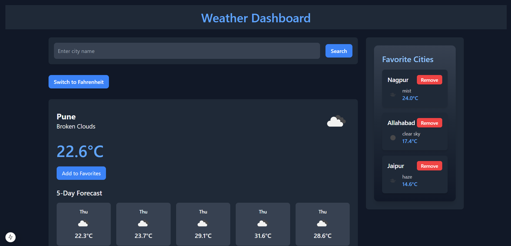

# Weather Dashboard



## Description
The Weather Dashboard is a web application built using Next.js, TypeScript, and TailwindCSS. It allows users to search for the current weather and a 5-day forecast for any city. Users can also add cities to a list of favorites, manage them, and toggle between Celsius and Fahrenheit for temperature display. A JSON server is used to store and retrieve favorite cities, with full CRUD support.

## Features
- Search for a city to view the current weather and 5-day forecast.
- Add cities to a list of favorites.
- Remove cities from the favorites list.
- View weather details for favorite cities.
- Toggle between Celsius and Fahrenheit.
- Persist the last searched city using local storage.

## Technologies Used
- **Frontend:** Next.js, TypeScript, TailwindCSS
- **Backend:** JSON Server
- **API:** OpenWeatherMap API

## Setup Instructions

### Prerequisites
- Node.js installed on your machine.
- An API key from OpenWeatherMap.

### Installation
1. Clone the repository:
   ```bash
   git clone https://github.com/Khushal251/weather-dashboard.git
   cd weather-dashboard
   ```
2. Install dependencies:
   ```bash
   npm install
   ```
3. Create a `.env` file in the root directory and add the following variables:
   ```env
   NEXT_PUBLIC_OPENWEATHER_API_KEY=331274d7de0e7284ba83f54e728a9057
   NEXT_PUBLIC_JSON_SERVER_URL=http://localhost:5000
   ```
4. Start the JSON server:
   ```bash
   npx json-server --watch db.json --port 5000
   ```
5. Start the development server:
   ```bash
   npm run dev
   ```

### Obtaining an OpenWeatherMap API Key
1. Visit [OpenWeatherMap](https://openweathermap.org/) and sign up or log in.
2. Navigate to the API section and generate a new API key.
3. Replace the placeholder API key in the `.env` file with your own key.

## Usage
- Use the search bar to find the weather details for any city.
- Click on "Add to Favorites" to save the city to your favorites list.
- Use the "Remove" button to delete a city from the favorites list.
- Toggle between Celsius and Fahrenheit using the provided button.
- The application remembers the last searched city using local storage.
